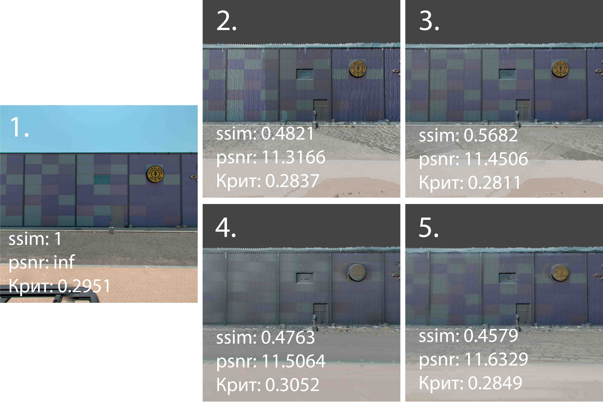
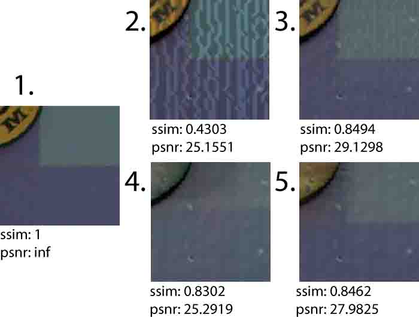
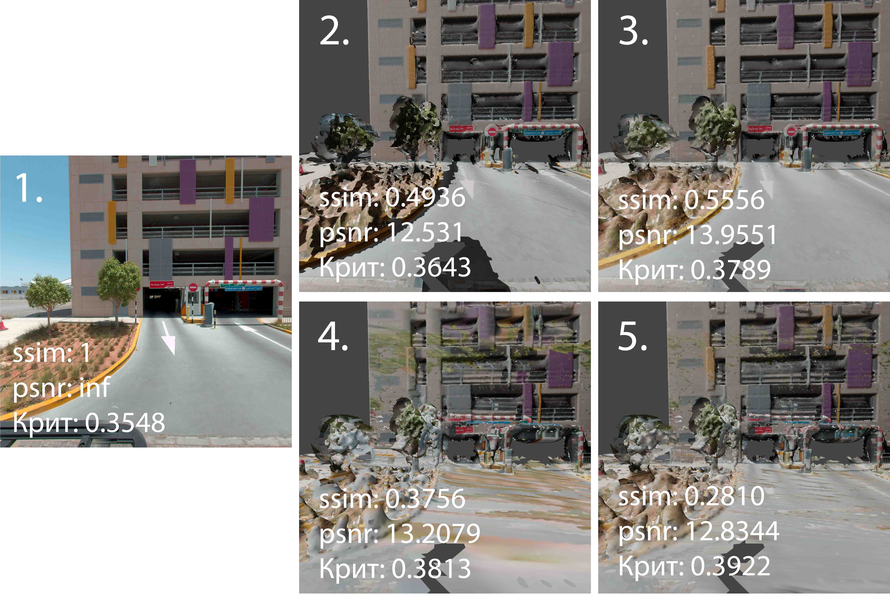
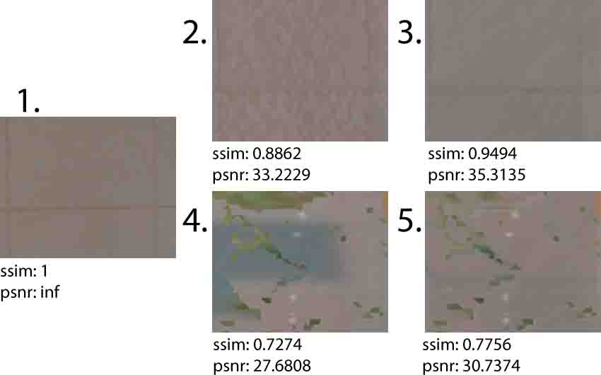
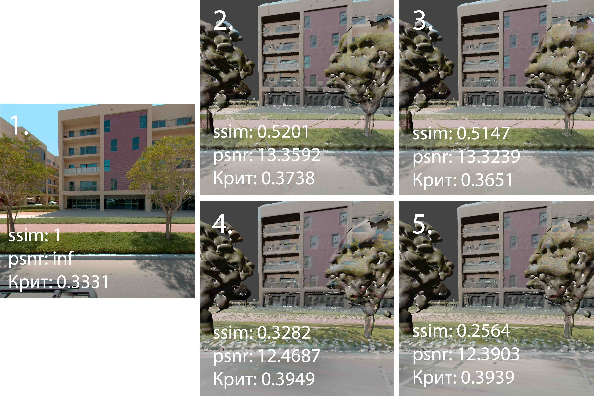
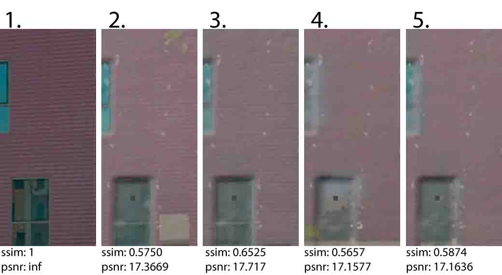

# Urban_Reconstruction

Библиотека позволяет строить текстурированную сетку (меш).
Позволяет преобразовывать панорамные изображения с углом обзора 360° в формат cubemap,
а также создает файлы поз камер, поддерживаемые библиотекой PCL, для каждого изображения формата cubemap.
Позволяет создавать меш, а также применять фильтр, удаляющий достраиваемые методом Пуассона треугольники меша.

В библиотеке реализован алгоритм текстурирования, основанный на базе алгоритма текстурирования из библиотеки PCL.
Алгоритм текстурирует исходя из принципа наибольшая площадь проекции,
а затем можно применить оптимизацию переноса цвета между текстурами для одного и того же полигона,
чтобы учитывать цвет с нескольких кадров.

# Сборка
## Установка зависимостей (для Ubuntu)

### Установка нужных пакетов:
```
sudo apt-get update
sudo apt-get -y install cmake g++ make
```
### Установка PCL:
```
sudo apt-get install -y libpcl-dev
```
### Установка Vulkan:
```
sudo apt-get install -y libvulkan-dev
```
### Установка Vulkan:
```
sudo apt-get install -y libvtk9-dev
```
### Установка OpenCV:
```
sudo apt-get install -y build-essential cmake git libgtk2.0-dev pkg-config libavcodec-dev libavformat-dev libswscale-dev
sudo apt-get install -y libopencv-dev
```
### Установка Boost:
apt-get устанавливает версию старее 1.75.0, поэтому устанавливаем вручную 
```
sudo apt update
sudo apt install build-essential
wget https://boostorg.jfrog.io/artifactory/main/release/1.75.0/source/boost_1_75_0.tar.gz
tar -xzvf boost_1_75_0.tar.gz
cd boost_1_75_0
./bootstrap.sh --prefix=/usr/local
sudo ./b2 install
ls /usr/local/include/boost
```
Установка с помощью apt-get (нужна версия boost >= 1.75.0)
```
sudo apt-get install -y libboost-all-dev
```
### Установка Eigen3:
```
sudo apt-get install -y libeigen3-dev
```
# Компиляция
```
mkdir build
cd build
cmake ..
cmake --build .
```
# Примеры
Примеры использования можно посмотреть в файле texturing_map_example.cpp.

Запуски метрик находятся в файле metrics_examples.cpp.
# Эксперименты

### Были произведены замеры метрик для

#### 1 – изображения,

#### 2 – алгоритм выбора текстуры с наибольшей площадью проекции,

#### 3 – алгоритм выбора текстуры с наибольшей площадью проекции + перенос цвета,

#### 4 – алгоритм текстурирования из библиотеки PCL,

#### 5 – алгоритм текстурирования из библиотеки PCL + перенос цвета.

<div style="display: flex; margin-bottom: 1%">
</div>
<div style="display: flex; margin-bottom: 1%">
</div>
<div style="display: flex; margin-bottom: 1%">
</div>
